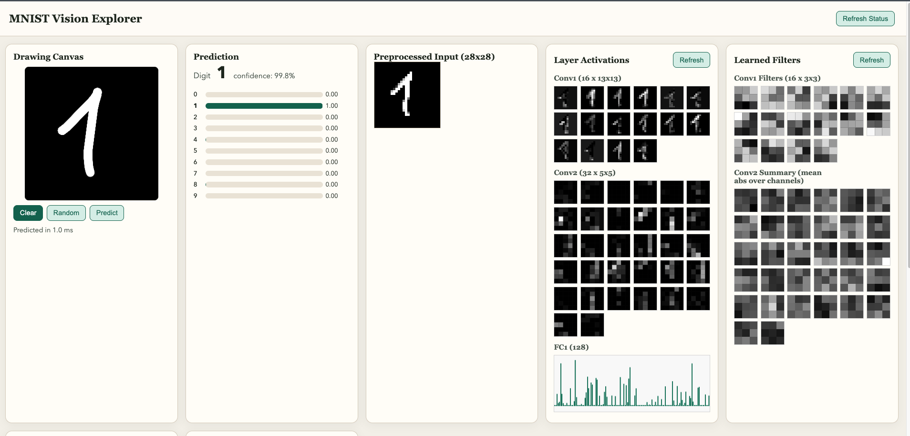

# MNIST Vision Explorer

Interactive MNIST digit recognition playground that exposes model internals with a FastAPI backend and a static frontend.



## Features

- Real-time prediction from a drawing canvas
- Activation visualization (`conv1`, `conv2`, `fc1`)
- Learned filter inspection
- Weight distribution histograms
- Background training API with status polling

## Quick Start

```bash
uv sync --dev
uv run serve
```

Open `http://127.0.0.1:8000`.

## Train a Model

### API-driven background training

```bash
curl -X POST http://127.0.0.1:8000/api/model/train \
  -H 'content-type: application/json' \
  -d '{"epochs":3,"batch_size":128,"lr":0.001,"force_restart":false}'
```

Check status:

```bash
curl http://127.0.0.1:8000/api/model/status
```

### Offline CLI training

```bash
uv run train --epochs 3 --batch-size 128 --lr 0.001
```

Weights are saved at `src/model/weights/mnist_cnn.pt`.

## Tests

```bash
uv run pytest
```
